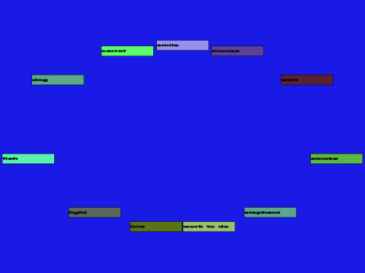
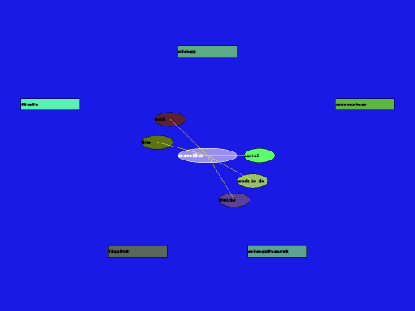

==============================
New nodes onto floating buffer
==============================

When writing notes, it would be useful to first enter the data and
then (reprocess and) connect it to an existing structure.

Mudyc developed a nice solution demo for this. 

 1. press 'tab' to 'lost the focus'
 2. enter the data and a new node is created

    Note: entering multi-line content should be allowed

 3. press 'tab' to enter a new node
 4. previously entered node remains non-connected and
    floats on view's nadir
 
Later the floating nodes can be connected to structure using mouse
(keybindings should be possible, but mouse would be the most natural
way).

In mudyc's demo connections were created in special mode with only
mouse (using `rmb_action_switch`__). Of course something like CTRL +
mouse could also be considered.

.. _rmb: ../rmb_action_switch--humppake/idea.gen.html
__ rmb_

Discussion
==========

Would it be a problem that nodes would float among buoys?

