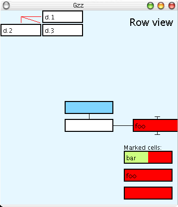

=====================
List for marked nodes
=====================

To allow connecting faraway nodes which cannot be shown on the same
focus+context view, we need to allow marking of those nodes.

Benja had already developed a list for marked nodes into GZZ client,
but after abandoning GZZ this feature was kind of lost. Of course,
this will be a feature of full working Loom, but this would also be
useful in Fenfire's MindMap (later MM) applitude.

MM has a 2D structure view, where marked node list could work as it
worked in GZZ: marked nodes can be connected to accursed node.

In MM nodes created in 2D structure view must also be able to place 
on 2D canvases. When on 2D canvas view, marked nodes in list should
be able to drag & drop onto canvas.

New features:

- nodes can be dragged & dropped onto 2D canvas

  + in MM this will cause a connection between marked node and paper node
    representing that canvas, also dropping coordinates are added into
    connection
